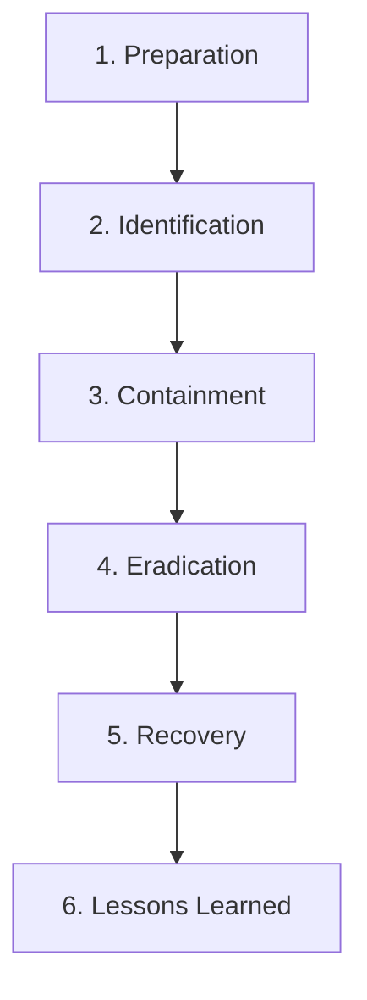

# Liwanag Organization: Security Incident Response Playbook
**Document Version:** 1.0  
**Effective Date:** May 21, 2026  
**Purpose:** Standard Operating Procedures for Security Breach Containment and Active Mitigation

---

## 1. Incident Response Lifecycle
This playbook outlines the six-stage incident response methodology aligned with NIST SP 800-61 to identify, isolate, and eradicate security threats on the Liwanag Student Workstation.

---

## 2. Phase-by-Phase Procedures

### Phase 1: Preparation
* **Objective:** Establish prevention protocols prior to any security breach.
* **Procedures:**
  * Enforce strict MFA gating for all active user profiles.
  * Enable AES-GCM data encryption by default.
  * Maintain system firewalls with default-deny policies on non-essential communication ports.

### Phase 2: Identification
* **Objective:** Detect and analyze system anomalies or active breach attempts.
* **Indicators of Compromise (IoC):**
  * **Brute-Force signature:** Detection of **5 or more failed authentication attempts** within a 1-minute window originating from a single IP source.
  * **Intrusion attempt:** SQL Injection (SQLi) patterns matched against system input fields (e.g. quotes `'`, double dashes `--`, or logical tautologies `OR 1=1`).
* **Auditing Logs:** System monitors must actively log auth failures, role violations, and database transaction states to a secure, immutable log file.

### Phase 3: Containment
* **Objective:** Stop the attack immediately and prevent it from spreading.
* **Automated Containment Procedures:**
  * **Host Blacklisting:** Upon detecting a Brute-Force IoC, the workstation's active response handler must dynamically inject a **Firewall DENY rule** blocking the source IP (e.g. `192.168.1.105`) at the local network level.
  * **Session Termination:** If high-risk payloads or database intrusions are identified, the system must immediately revoke the active user session context, execute a hard logout (`performSecureLogout`), and isolate the client session.

### Phase 4: Eradication
* **Objective:** Identify the root cause and completely remove the threat.
* **Procedures:**
  * Analyze firewall drop-logs to isolate the host threat vector.
  * Purge all temporary session stores, `sessionStorage` tokens, and invalid local caches.
  * Patch vulnerabilities (e.g., input sanitization routines, backend parameterizations).

### Phase 5: Recovery
* **Objective:** Restore affected systems back to normal production state.
* **Procedures:**
  * Re-validate system security scores using the Security Compliance Audit panel.
  * Safely restore encrypted database backups.
  * Gradually whitelist blocked IPs after security verification and credentials rotation.

### Phase 6: Lessons Learned
* **Objective:** Review the incident to improve future defensive layers.
* **Procedures:**
  * File a formal Incident Report detailing the timeline, source IP, affected resources, and actions taken.
  * Refine threat signature filters (e.g. adding stricter patterns to the active response monitor).
  * Update security training policies.

---

## 3. Incident History Log (Simulation Capture)
Below is an incident log record generated during an active response simulation:

* **Incident ID:** INC-2026-0521-01
* **Incident Type:** Automated Brute-Force Block
* **Timestamp:** 2026-05-21T10:16:05Z
* **Source Host:** IP `192.168.1.105`
* **Trigger Event:** 5 consecutive invalid login credentials attempted.
* **Containment Action:** Active Response system dynamically added a firewall filter blocking all traffic from IP `192.168.1.105` on all ports. Threat status was successfully reduced to **CONTAINED**.
